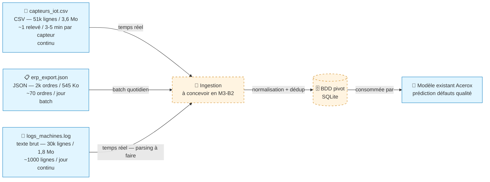

# Schéma des flux de données — Acerox Métallurgie

> Schéma Mermaid à compléter. Doit montrer :
> - **Sources** (capteurs IoT, ERP, logs, *bonus rapports `.md`*)
> - **Ingestion** (à concevoir en M3-B2)
> - **BDD pivot** (à modéliser en M3-B2)
> - **Modèle existant** Acerox (placeholder, hors-sujet ici)
>
> Légende explicite : qui produit, qui consomme, contraintes.

## Schéma

## Légende

- **Producteurs** : 3 sources Acerox — capteurs IoT (CSV, temps réel), ERP (JSON, batch quotidien), logs machines (texte, temps réel).
- **Consommateur final** : le modèle de prédiction des défauts qualité.
- **Existant (trait plein)** : les 3 sources et le modèle de prédiction.
- **À construire (pointillé)** : l'ingestion (normalisation + déduplication) et la BDD pivot.
- **Contraintes critiques** : `ouvrier_id` de l'ERP = donnée personnelle (RGPD) ; fraîcheur hétérogène (capteurs/logs continus vs ERP journalier) ; qualité (doublons CSV, capteur Roubaix L3 figé, logs à parser).

## Décisions associées

- Source(s) retenues en priorité : `capteurs_iot.csv` (signaux température/vibration/débit) et `logs_machines.log` (les ERROR comme proxy du défaut).
- Source(s) écartées : `erp_export.json` — export **batch quotidien**, fraîcheur incompatible avec un scoring préventif quasi temps réel (+ enjeu RGPD `ouvrier_id`).
- Source bonus (rapports `.md`) traitée ? non — mission RAG optionnelle non traitée.

---

*Schéma produit par franck, 2026-07-21, dans le cadre du brief M3-B1 Dev-Id.*
